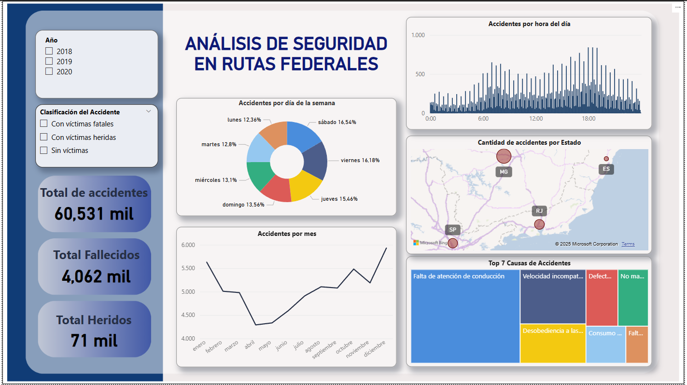

# Traffic Accidents Dashboard

This Power BI project presents an interactive dashboard that visualizes car accident statistics and their geographic distribution. The dashboard aims to support data-driven decisions related to road safety and urban planning.

## 📊 Features

- Total number of accidents by year
- Accidents by severity level
- Time-based trends (day of week, hour of day)
- Accident causes and types
- Interactive map showing accident locations
- Filtering by city, weather condition, and vehicle type

## 🛠️ Tools

- **Power BI Desktop**
- Excel / CSV (as data source)
- DAX for custom KPIs and time intelligence

## 📁 Project Structure

/data → Raw and cleaned data files (CSV or Excel)

/traffic-accidents-dashboard.pbix → Power BI report file

/screenshots/ → Visual previews of the dashboard

## 📷 Dashboard Preview

## 🚀 How to Use

1. Download or clone this repository.
2. Open the `dashboard.pbix` file using Power BI Desktop.
3. Update the data source paths if necessary.
4. Explore the dashboard with built-in filters and visuals.

## 📌 Notes

- This project uses anonymized and publicly available data.
- The visuals are designed to support exploratory analysis and public awareness.

## 📫 Contact

Created by Samuel Castaño Mira.  
Feel free to connect via GitHub or [LinkedIn](https://www.linkedin.com/in/samuel-casta%C3%B1o-596136314/).

---

